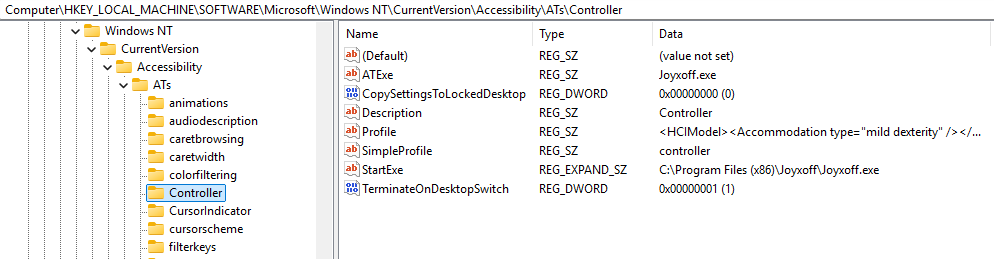
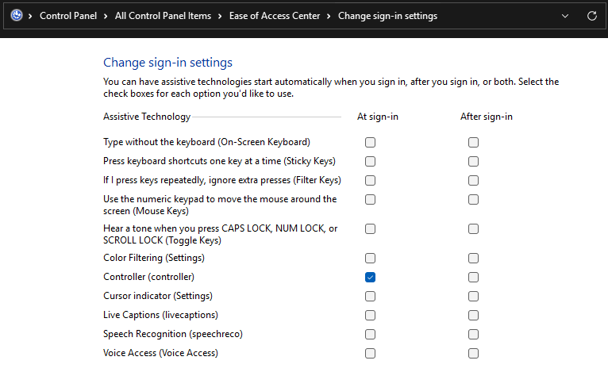

This guide will assume you are using an XInput compatible controller, if that is not the case, there are other resources available to convert whatever you are using to XInput to make this work.

First, install Joyxoff

https://joyxoff.com/en/

Make note of the install location of the Joyxoff executable, you will need it later. The default is `C:\Program Files (x86)\Joyxoff\Joyxoff.exe` which we will call <joyxoffpath>

Next we need to enable this to run on the Login Screen

This involves some registry modification to allow, essentially adding it as an Assistive Technology application

IF you want to learn more about that see here: https://learn.microsoft.com/en-us/windows/win32/winauto/ease-of-access---assistive-technology-registration

[controller.reg](controller.reg) contains the details of the required keys or can be downloaded and merged



Once Joyxoff is added as an Assitive Technology, it needs to be enabled in the Control Panel | Ease of Access Center | Change sign-in settings (on the left column)



Once this is completed and enabled, perform a full restart (shut down and reboot)

The controller SHOULD connect at the lock screen and the left joystick moves the mouse.

The Joyxoff configs I slightly modified are [virtual keyboard](vk.joyx) and [desktop](desktop.joyx)
```
The only changes are making the default left joystick click
open the native Windows 11 touch keyboard (tabtip.exe)
`C:\Program Files\Common Files\microsoft shared\ink\TabTip.exe`
and setting the Joyxoff koyboard to launch with the modifier key
(left controller face button)
```

# CAVEATS
This does not appear to work on the Lock Screen, only the initial boot Login Screen

The Joyxoff tray icon does not appear to load, this can be force reloaded by killing the Joyxoff.exe process and launching it again once you have logged in
